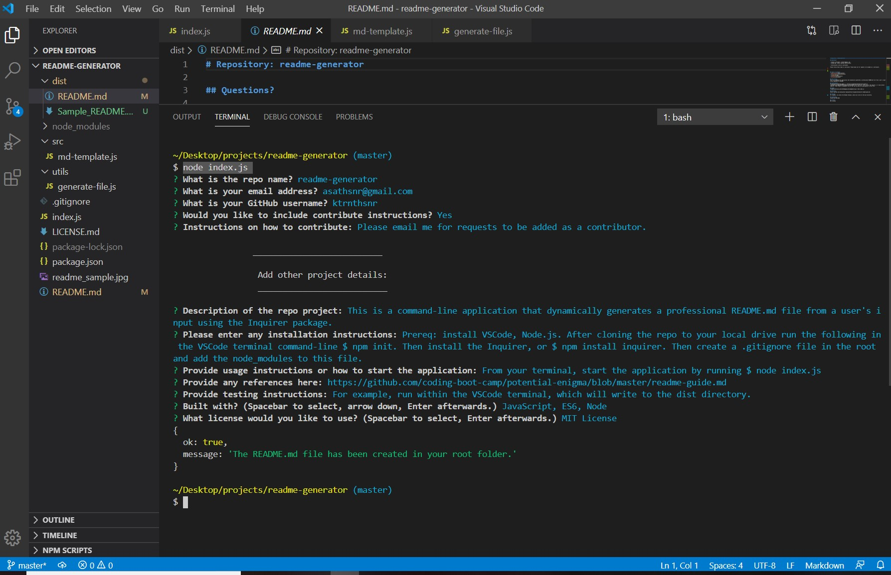

# Readme-Generator

## GitHub
* GitHub URL: https://github.com/ktrnthsnr/readme-generator

## Table of Contents
* [Description](#description)
* [Installation](#installation)
* [Usage](#usage)
* [Reference](#reference)
* [Testing](#testing)
* [Technology](#technology)
* [Contribute](#contribute)
* [License](#license)
* [Contact](#contact)

## Description
This is a command-line application that dynamically generates a professional README.md file from a user's input using the Inquirer package.

## Installation
- Prereq: install VSCode, Node.js
- After cloning the repo to your local drive, run the following in the VSCode terminal command-line
- $ npm init
- Install npm Inquirer
- $ npm install inquirer
- Create a .gitignore file in the root and add node_modules this file.
- If you need to re-add the dependencies, run $ npm install

## Usage
* From your terminal, start the application by running 
* $ node index.js
* You may copy or use this README.md to any new repo.
* Here is a sample of the questions through the command-line

## Reference
https://github.com/coding-boot-camp/potential-enigma/blob/master/readme-guide.md

## Testing
* For example, run the application within the VSCode terminal, which when complete will write a new README.md file to the /dist folder.
* Here is an example of the markdown file created:

A link to view usage, testing and the README.md file created is included here:
https://drive.google.com/file/d/106Jf_Ft1Jw6Ge3mm7FnWoViHj5umOK29/view

## Technology
JavaScript, ES6, Node, npm Inquirer

## Contribute
Please email me for requests to be added as a contributor, or for any additional suggestions.

## License
MIT License

## Contact
https://github.com/ktrnthsnr/ktportfolio

### ©️2020 ktrnthsnr
