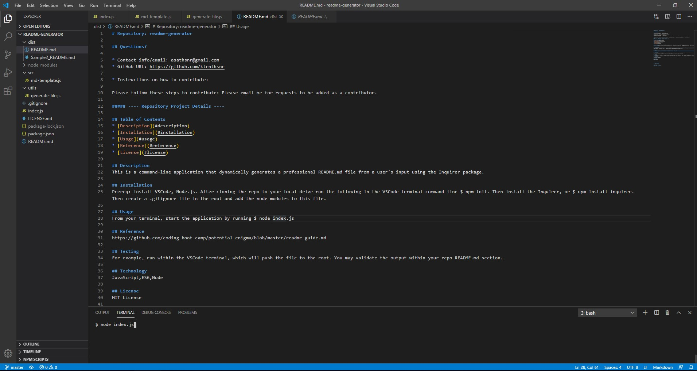

# Readme-Generator

## GitHub
* GitHub URL: https://github.com/ktrnthsnr/readme-generator

## Table of Contents
* [Description](#description)
* [Installation](#installation)
* [Usage](#usage)
* [Reference](#reference)
* [Testing](#testing)
* [Technology](#technology)
* [Contribute](#contribute)
* [License](#license)
* [Contact](#contact)

## Description
This is a command-line application that dynamically generates a professional README.md file from a user's input using the Inquirer package.

## Installation
- Prereq: install VSCode, Node.js
- After cloning the repo to your local drive, run the following in the VSCode terminal command-line
- $ npm init
- Install npm Inquirer
- $ npm install inquirer
- Create a .gitignore file in the root and add node_modules this file
- If you need to re-add the dependencies, run $ npm install

## Usage
* From your terminal, start the application by running 
* $ node index.js
* Copy the README.md to any new repo's root directory

## Reference
https://github.com/coding-boot-camp/potential-enigma/blob/master/readme-guide.md

## Testing
For example, run within the VSCode terminal, which will push the file to the root. You may validate the output within your repo README.md section.

A link to view usage and a sample is included here: 

## Technology
JavaScript,ES6,Node

## Contribute
Email me on any suggestions for code improvements you wish to contribute.

## License
MIT License

## Contact
Profile info: https://github.com/ktrnthsnr/ktportfolio

### ©️2020 ktrnthsnr
